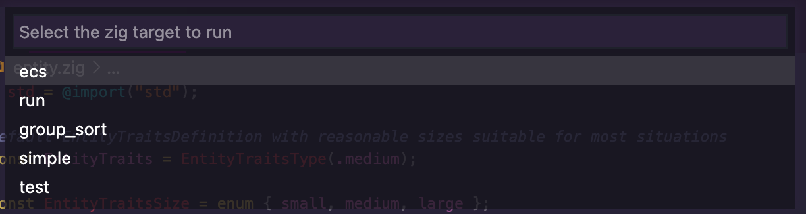

# vscode-build-zig


[Zig](http://ziglang.org/) build support for Visual Studio Code.



## Features

 - provides a parser for finding `zig build` targets

## Usage

Open your `tasks.json` file and create two new build tasks (the second is optional):

```json
{
    "tasks": [
        {
            "label": "Build and Run Specific Target",
            "type": "shell",
            "command": "zig build ${input:zigTarget}",
            "problemMatcher": [
                "$gcc"
            ],
            "group": {
                "kind": "build",
                "isDefault": true
            },
            "presentation": {
                "clear": true
            }
        },
        {
            "label": "Build and Run Last Target",
            "type": "shell",
            "command": "zig build ${input:zigLastTarget}",
            "problemMatcher": [
                "$gcc"
            ],
            "group": {
                "kind": "build",
                "isDefault": true
            },
            "presentation": {
                "clear": true
            }
        }
    ],
    "inputs": [
        {
            "id": "zigTarget",
            "type": "command",
            "command": "zig.build.getTargets",
        },
        {
            "id": "zigLastTarget",
            "type": "command",
            "command": "zig.build.getLastTargetOrPrompt"
        }
    ]
}
```

The key is to use the commands exposed by the extension.
- `zig.build.getTargets`: parses your build targets and provides a selection list to choose the one to execute `zig build TARGET`
- `zig.build.getLastTargetOrPrompt`: if a previous target was used this skips parsing the build targets and just runs it, else it is that same as `zig.build.getTargets`


## Creating .vsix extension file

```
npm install
tsc src/extensions.js
npx vsce package
```
